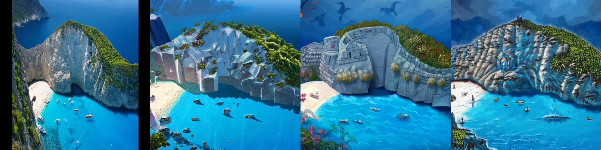

# Style Transfer using Diffusion Models

### Problem Statement

 Contrary to prompt-based style transfer, the method should follow 1) to use a set of example images for a given style and transfer it to newly generated images of arbitrary contexts. The method should work on novel styles, such as your own drawing style.


## Instructions

1. Create virtual environment and install required packages from requirements.txt

2. Run LoRA fine-tuning with new art style images (Rayonism)

```
bash scripts/train.sh > train.log 2>&1
```
The LoRA checkpoints are saved in lora_ckpt.

3. Run inference on image, or folder, or from text prompt. If inference on a particular image is desired, put image path in --image_path of scripts/infer_img.sh. adjust inference steps, strength, and then

```
bash scripts/infer_img.sh
```

## Results

First image is the input image





